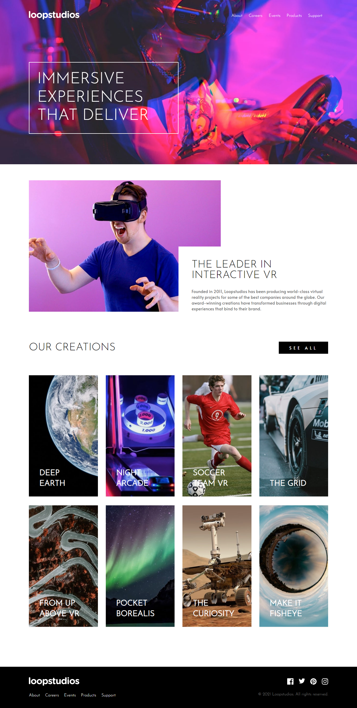

# Frontend Mentor - Loopstudios landing page solution

This is a solution to the [Loopstudios landing page challenge on Frontend Mentor](https://www.frontendmentor.io/challenges/loopstudios-landing-page-N88J5Onjw). Frontend Mentor challenges help you improve your coding skills by building realistic projects.

## Table of contents

- [Overview](#overview)
  - [The challenge](#the-challenge)
  - [Screenshot](#screenshot)
  - [Links](#links)
- [My process](#my-process)
  - [Built with](#built-with)
  - [What I learned](#what-i-learned)
  - [Useful resources](#useful-resources)
- [Author](#author)

## Overview

### The challenge

Users should be able to:

- View the optimal layout for the site depending on their device's screen size
- See hover states for all interactive elements on the page

### Screenshot

### Links

- Solution URL: [https://github.com/michaeljohnson-mj/frontend-mentor-loopstudios-landing-page.git](https://github.com/michaeljohnson-mj/frontend-mentor-loopstudios-landing-page.git)
- Live Site URL: [https://michaeljohnson-mj.github.io/frontend-mentor-loopstudios-landing-page/](https://michaeljohnson-mj.github.io/frontend-mentor-loopstudios-landing-page/)

## My process

### Built with

- Semantic HTML5 markup
- CSS custom properties
- Flexbox
- CSS Grid

### What I learned

- Usage of CSS Grids.
- Usage of css units like "rem".
- To create menu in mobile responsive mode.

### Useful resources

- [W3schools](https://www.w3schools.com/css/css_grid.asp) - This documentation helped me in understanding the CSS Grids.
- [Kevin Powell](https://youtu.be/rg7Fvvl3taU) - This is an amazing youtube video which helped me understand CSS Grids practically. I'd recommend it to anyone still learning this concept.

## Author

- Website - [https://www.michaeljohnson.tech](https://www.michaeljohnson.tech)
- Frontend Mentor - [https://www.frontendmentor.io/profile/michaeljohnson-mj](https://www.frontendmentor.io/profile/michaeljohnson-mj)
